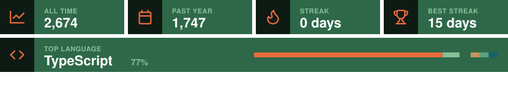

## Hi there 👋

## Here's a bit about me:

<table>
<tr>
<td width="60%" valign="top">

- 💻 I'm a **full-stack developer** based in Nairobi, Kenya 🇰🇪
- 🎓 BSc in **Mathematics & Computer Science**
- 🧩 I build **APIs, payments and product logic**, replacing manual processes with software
- 🌱 Ask me about: TypeScript, React, Next.js, NestJS, Node.js, PostgreSQL
- 📝 I write and keep notes at [The Unfolded Origami](https://theunfoldedorigami.com), *ideas, slowly unfolded*

</td>
<td width="40%" align="center">

</td>
</tr>
</table>

## Things I've built:

- 🛠️ **KIFWA**: multi-tenant bond and indemnity platform for 2,000+ clearing agents, insurers and freight providers
- 💸 **KayaSend**: remittances for the Kenyan diaspora
- 🏆 **E4CInsights**: AI policy synthesis tool (prize winner)

More on my [portfolio](https://theunfoldedorigami.com).

## Tech I use:

> 📫 How to reach me: [Email](mailto:muigastephen14@gmail.com) · [LinkedIn](https://linkedin.com/in/stevemuiga) · [Portfolio](https://theunfoldedorigami.com)
